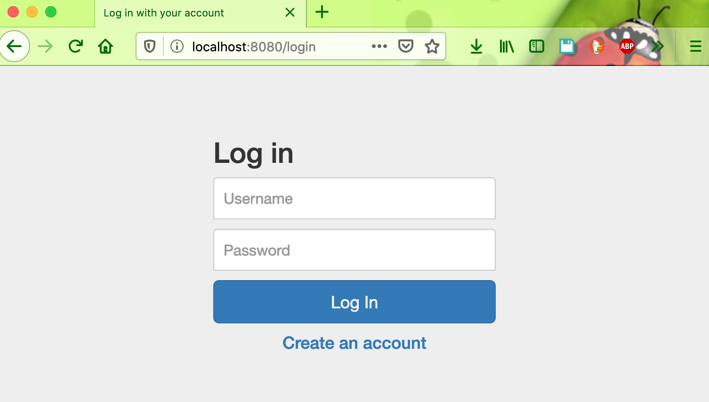
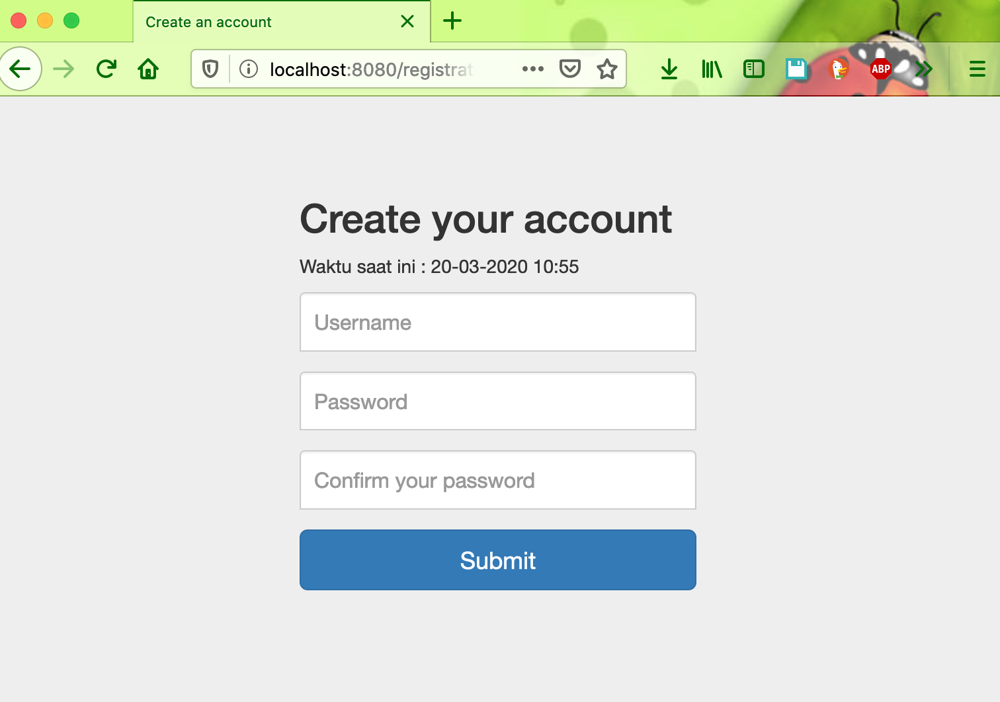

# spring-boot-registration
Registration and Login Example with Spring Security, Spring Boot, Spring Data JPA &amp; HSQL

## Things to do
1. Clone this repository:
    ```
    git clone https://github.com/hendisantika/spring-boot-registration.git
    ```
2. Go to your folder:
    ```
    cd spring-boot-registration
    ```
3. Run the application by this command:
    ```
    mvn clean spring-boot:run
    ```

## Screen shot

Login Page



Registration Page

